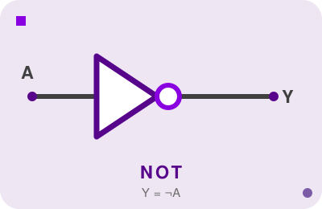
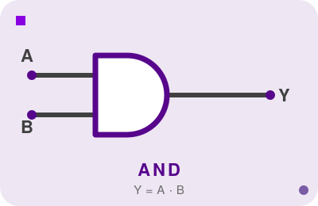
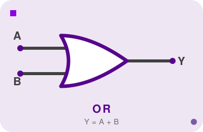
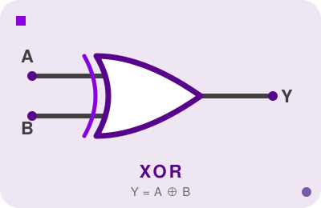
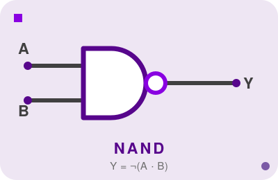
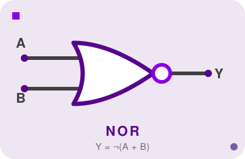
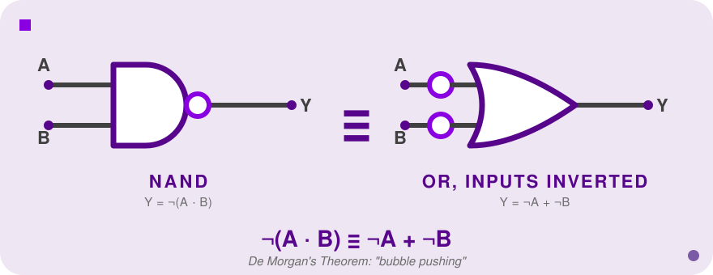
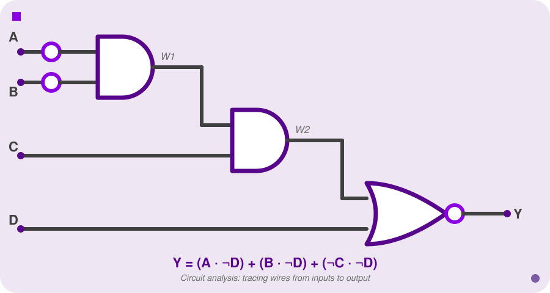

<h2 align=center>Week I</h2>

<h1 align=center>Introduction & Logic Gates</h1>

<p align=center><strong><em>Song of the day</strong>: <a href="https://youtu.be/8vEahj1dd2E?si=xolYZwJgVFHl8Qtl"><strong><u>Arcturus Beaming</u></strong></a> by The Crane Wives (2024)</em></p>

---

## Sections

1. [**How Does a Computer Work?**](#0)
2. [**Logic Gates**](#1)
    1. [**The NOT Gate**](#1-1)
    2. [**The AND Gate**](#1-2)
    3. [**The OR Gate**](#1-3)
    4. [**XOR, NAND, and NOR**](#1-4)
3. [**Boolean Algebraic Notation**](#2)
4. [**Circuit Analysis: Deriving Expressions and Truth Tables**](#3)
5. [**Representing Numbers in Binary**](#4)
6. [**Hexadecimal**](#5)
7. [**Two's Complement**](#6)

---

<a id="0"></a>

## How Does a Computer Work?

This is the question at the heart of what we'll be doing all semester—and it turns out to be a surprisingly deep one.

Ask someone off the street and you'll hear things like "electricity" or "there's a chip in there." None of these are exactly wrong, but none of them explain the *mechanism*. Our goal is to build a complete picture: from the physics of electrons all the way up to the software you interact with every day. And the picture, once assembled, is genuinely striking—because those two ends are extraordinarily far apart.

Consider what it takes to run a Python script. The programmer writing it doesn't need to know what a transistor is. The transistor doesn't need to know what Python is. And yet they compose seamlessly, layer by layer, with each one speaking a completely different language than the one above it. The idea that makes this possible is **abstraction**—each layer hides its complexity behind a clean interface and trusts that the layer beneath it works. When you write `x + y` in Python, you are standing on top of a compiler, an assembler, an instruction set, a datapath, a handful of logic gates, and somewhere at the bottom, a few transistors switching on and off. None of those layers know about each other. They don't have to.

```
┌──────────────────────┬───────────────────────────────────┐
│  Application Software│  Programs                         │
├──────────────────────┼───────────────────────────────────┤
│  Operating Systems   │  Device Drivers                   │
├──────────────────────┼───────────────────────────────────┤
│  Architecture        │  Instructions, Registers          │
├──────────────────────┼───────────────────────────────────┤
│  Microarchitecture   │  Datapaths, Controllers           │
├──────────────────────┼───────────────────────────────────┤
│  Logic               │  Adders, Memories                 │
├──────────────────────┼───────────────────────────────────┤
│  Digital Circuits    │  AND Gates, NOT Gates             │
├──────────────────────┼───────────────────────────────────┤
│  Devices             │  Transistors, Diodes              │
├──────────────────────┼───────────────────────────────────┤
│  Physics             │  Electrons                        │
└──────────────────────┴───────────────────────────────────┘
```

This course lives in the middle of this stack—**digital circuits**, **logic**, **microarchitecture**, and **architecture**. This is the layer where the interesting engineering decisions get made: how instructions are encoded, how a datapath is wired, how memory is organized. The physics below us sets constraints we have to respect; the software above us is what we're ultimately building for.

To understand where we're starting, it helps to trace the journey from source code down to hardware once:

1. A programmer writes **application software** in a high-level language like C or Python.
2. A **compiler** translates that source code into **assembly language**—a human-readable form of the machine's native instruction set.
3. An **assembler** translates assembly into **machine language**—raw binary, the actual bytes the processor reads.
4. The **processor** executes those bytes by switching billions of tiny transistors on and off.

### What Is a Gate, Actually?

A **transistor** is a semiconductor device that acts as an electrically controlled switch: apply enough voltage to the control terminal and current flows; remove it and current stops. That binary on/off behavior is exactly what we need to represent 1 and 0.

A **logic gate** is what you get when you wire a small number of transistors together in a specific configuration—a circuit element that takes binary inputs and produces a single binary output according to a fixed rule. AND, OR, NOT: that's it. And yet everything your CPU does—running a video game, encrypting a file, rendering a webpage—is ultimately just those three operations, composed in very large numbers. A modern chip contains tens of billions of these switches on a piece of silicon the size of a fingernail.

That's the thing worth holding onto as we start: the gap between "flip a switch" and "run a program" is enormous, and crossing it is what this course is about. The gates are where we begin.

---

<a id="1"></a>

## Logic Gates

Every gate can be described in three different ways, and you'll encounter all three in the wild: circuit **diagrams** in datasheets and textbooks, **Boolean equations** in papers and design documents, and **truth tables** in verification and testing. They contain exactly the same information—just expressed in different languages. Being able to move fluidly between them is less about memorization and more about having enough practice that the translation becomes automatic.

For each gate below, all three representations are given side by side. Try reading the truth table from the equation, and the equation from the diagram, until they feel like the same thing.

---

<a id="1-1"></a>

### The NOT Gate

The NOT gate—also called an **inverter**—is the right place to start because it's the only gate with a single input, and it introduces a symbol you'll see constantly: the **inversion bubble**. That small circle on the output is what makes the gate a NOT gate. Without it, the triangle is just a wire—it passes the signal through unchanged. The bubble is the negation. You'll see it reappear on NAND, NOR, and in the middle of complex schematics wherever a signal needs to be flipped.

**Gate symbol:**

<a id="fg-1"></a>

<p align=center>
    
    </img>
</p>

<p align=center>
    <sub>
        <strong>Figure I</strong>: The NOT gate—a triangle with an inversion bubble on the output.
    </sub>
</p>

**Boolean equation:**

```
Y = Ā   (also written  Y = A',  Y = ¬A,  Y = ~A)
```

**Truth table:**

| A | Y |
|---|---|
| 0 | 1 |
| 1 | 0 |

---

<a id="1-2"></a>

### The AND Gate

The AND gate outputs 1 only when **all** of its inputs are 1—a useful way to think of it is as an "enable" gate. If A is the signal you want to pass through, and B is an enable line, then `A AND B` passes A only when B is high and blocks it when B is low. Nearly every conditional enable in hardware has AND somewhere at its core.

**Gate symbol** (flat back, rounded/D-shaped front):

<a id="fg-2"></a>

<p align=center>
    
    </img>
</p>

<p align=center>
    <sub>
        <strong>Figure II</strong>: The AND gate—flat back, rounded D-shaped front.
    </sub>
</p>

**Boolean equation:**

```
Y = AB   (also written  Y = A·B,  Y = A×B,  Y = A∧B)
```

The juxtaposition notation `AB` (no operator symbol) means AND, by direct analogy with multiplication in algebra—AND really does behave like multiplication over {0, 1}.

**Truth table:**

| A | B | Y |
|---|---|---|
| 0 | 0 | 0 |
| 0 | 1 | 0 |
| 1 | 0 | 0 |
| 1 | 1 | 1 |

---

<a id="1-3"></a>

### The OR Gate

The OR gate outputs 1 when **at least one** input is 1. This is worth pausing on, because everyday English "or" is often exclusive—"soup or salad" usually means "pick one." Boolean OR is *inclusive*: it's 1 when one input is 1, when the other is 1, and also when both are 1. OR is the "merge" primitive—if any one of several conditions holds, the output is active.

**Gate symbol** (curved back, pointed front):

<a id="fg-3"></a>

<p align=center>
    
    </img>
</p>

<p align=center>
    <sub>
        <strong>Figure III</strong>: The OR gate—curved back, pointed front.
    </sub>
</p>

**Boolean equation:**

```
Y = A + B   (also written  Y = A∨B)
```

The `+` symbol for OR is borrowed from arithmetic. The analogy holds in a clamped way: OR behaves like addition, except that in Boolean algebra 1 + 1 = 1 rather than 2.

**Truth table:**

| A | B | Y |
|---|---|---|
| 0 | 0 | 0 |
| 0 | 1 | 1 |
| 1 | 0 | 1 |
| 1 | 1 | 1 |

---

<a id="1-4"></a>

### XOR, NAND, and NOR

Three more gates appear often enough to have their own symbols. Two of them have a property so useful it's worth calling out immediately.

**XOR** ("exclusive OR") outputs 1 when its two inputs *differ*—exactly one of them is 1. This is the version of "or" that matches everyday English most closely. More importantly for us, XOR turns out to be the addition primitive: when you add two single bits, the sum bit is exactly their XOR, and the carry-out is their AND. We'll see this again when we build adders.

<a id="fg-4"></a>

<p align=center>
    
    </img>
</p>

<p align=center>
    <sub>
        <strong>Figure IV</strong>: The XOR gate—an OR body with an extra curved line at the back.
    </sub>
</p>

```
Y = A ⊕ B
```

| A | B | Y |
|---|---|---|
| 0 | 0 | 0 |
| 0 | 1 | 1 |
| 1 | 0 | 1 |
| 1 | 1 | 0 |

**NAND** (NOT AND) is an AND gate with an inversion bubble on the output—its output is 0 only when *all* inputs are 1. The overbar in the Boolean equation covers the *entire* AND expression, not just one variable:

```
Y = ~(AB)   i.e., NOT of the whole product
```

<a id="fg-5"></a>

<p align=center>
    
    </img>
</p>

<p align=center>
    <sub>
        <strong>Figure V</strong>: The NAND gate—an AND body with an inversion bubble on the output.
    </sub>
</p>

| A | B | Y |
|---|---|---|
| 0 | 0 | 1 |
| 0 | 1 | 1 |
| 1 | 0 | 1 |
| 1 | 1 | 0 |

**NOR** (NOT OR) is an OR gate with an inversion bubble on the output—its output is 1 only when *all* inputs are 0:

```
Y = ~(A+B)   i.e., NOT of the whole sum
```

<a id="fg-6"></a>

<p align=center>
    
    </img>
</p>

<p align=center>
    <sub>
        <strong>Figure VI</strong>: The NOR gate—an OR body with an inversion bubble on the output.
    </sub>
</p>

| A | B | Y |
|---|---|---|
| 0 | 0 | 1 |
| 0 | 1 | 0 |
| 1 | 0 | 0 |
| 1 | 1 | 0 |

> **NAND and NOR are universal gates.** Any logic function—no matter how complex—can be built using *only* NAND gates, or alternatively *only* NOR gates. This is a remarkable fact: one gate type is sufficient to express all of Boolean logic. In chip fabrication it matters practically, because a design that uses only one cell type is simpler and cheaper to manufacture.

---

<a id="2"></a>

## Boolean Algebraic Notation

We now have six gates and a symbol for each. The problem is that as soon as a circuit involves more than a handful of gates, diagrams become unmanageable—there's no clean way to reason about whether two different circuits compute the same function, or to simplify a function to use fewer gates, without a way to write it down symbolically. What we need is an algebraic language.

**Boolean algebra** is that language: a system for writing logic functions as formulas over variables that can only take the values 0 and 1, with operators that correspond directly to gates. The immediate benefit is that you can manipulate an expression on paper—substituting, factoring, applying identities—without touching a single wire.

There's a practical complication: mathematicians, electrical engineers, and programmers all developed their own notation for the same operations, and all three traditions are still in use. You'll see all of these in textbooks, datasheets, and code:

| Operation | Notations you will encounter |
|-----------|------------------------------|
| NOT A     | `~A` &nbsp; `¬A` &nbsp; `Ā` &nbsp; `A'` |
| A AND B   | `A & B` &nbsp; `A ∧ B` &nbsp; `A · B` &nbsp; `AB` (juxtaposition) |
| A OR B    | `A \| B` &nbsp; `A ∨ B` &nbsp; `A + B` |
| A XOR B   | `A ^ B` &nbsp; `A ⊕ B` |

The `+` for OR and juxtaposition for AND come from Boolean's original mathematical framing. The `~`, `&`, and `|` come from C and most programming languages. The `¬`, `∧`, and `∨` come from formal logic. Knowing which tradition you're reading is usually obvious from context.

### Operator Precedence

Without knowing operator precedence, you can't read someone else's expression correctly—and a misread expression is a misunderstood circuit. The rule, from tightest to loosest binding:

1. **NOT**: applied to its immediate operand first
2. **AND**
3. **OR**: loosest binding

So `Ā · B + C` means `((NOT A) AND B) OR C`, not `NOT(A AND (B OR C))`. When there's any potential ambiguity, add parentheses. There's no cost to over-parenthesizing, and the cost of a precedence error is a wrong circuit.

### DeMorgan's Theorem

The single most useful simplification rule is **DeMorgan's Theorem**: negating an entire AND expression is the same as OR-ing the individual negations, and vice versa.

```
~(AB)   =  Ā + B̄
~(A+B)  =  Ā · B̄
```

You can verify either identity by checking the truth table for both sides—they match for every input combination. Why does this matter? Because it tells you that a NAND gate (output `~(AB)`) is *identical* to an OR gate with individually inverted inputs (`Ā + B̄`). These are two different physical implementations of the same function. Hardware designers exploit this deliberately: they'll draw a gate one way in a schematic but think about it the other way to make the circuit's intent clearer. This technique is called **bubble pushing**, and you cannot read professional schematics fluently without it.

<a id="fg-7"></a>

<p align=center>
    
    </img>
</p>

<p align=center>
    <sub>
        <strong>Figure VII</strong>: A NAND gate (left) and an OR gate with both inputs inverted (right) are the same circuit—DeMorgan's Theorem made physical.
    </sub>
</p>

---

<a id="3"></a>

## Circuit Analysis: Deriving Expressions and Truth Tables

Given a circuit diagram—the kind you'd find in a datasheet, a textbook problem, or the output of a synthesis tool—how do you figure out what it actually computes? That's circuit analysis: the skill of extracting the Boolean function from the wiring.

The method is straightforward. Start at the inputs and work toward the output, labeling each wire with the expression it carries as you go. Every gate transforms its input expressions into an output expression according to its function. When you reach the output wire, you have the full expression.

### Example

Here is the circuit from the recitation slides, with inputs A, B, C, D and output Y:

<a id="fg-8"></a>

<p align=center>
    
    </img>
</p>

<p align=center>
    <sub>
        <strong>Figure VIII</strong>: The example circuit redrawn—A and B inverted into the first AND, chained through a second AND with C, then a NOR with D.
    </sub>
</p>

**Step 1:** What does W1 carry?

The small circles (`○`) on the A and B input wires are **inversion bubbles**—they mean "negate this signal before it enters the gate." W1 and W2 are internal wires that don't connect to anything outside the circuit; they exist only to carry values between gates.

The first AND gate takes NOT A and NOT B as inputs (because of the bubbles). AND outputs 1 only when all inputs are 1, so:

```
W1 = (NOT A) AND (NOT B)  =  ~A & ~B
```

W1 is 1 only when both A and B are 0.

**Step 2:** What does W2 carry?

The second AND gate takes W1 and C, with no bubbles:

```
W2 = W1 AND C  =  (~A & ~B) & C  =  ~A & ~B & C
```

**Step 3:** What does Y carry?

The NOR gate gives `Y = ~(W2 OR D)`. Substituting W2 and applying DeMorgan's to push the negation inward:

```
~((~A & ~B & C) + D)  =  ~(~A & ~B & C)  &  ~D
                       =  (A + B + ~C)    &  ~D
```

Reading this in **sum-of-products (SOP)** form—a list of AND-terms OR'd together, where each AND-term describes one set of inputs that makes Y true:

```
Y = (~A & ~B & C) | ~D
```

In compact Boolean notation: **Y = ĀB̄C + D̄**

Reading it aloud: "Y is 1 when (A is 0 and B is 0 and C is 1), *or* when D is 0." SOP form is the standard way to express a combinational function, and it's what you'll use throughout this course.

### Building the Truth Table

With the expression in hand, building the truth table is mechanical: enumerate every possible input combination and evaluate the expression. With four inputs there are **2⁴ = 16** rows. A systematic strategy is to count up in binary from 0000 to 1111, which guarantees every combination appears exactly once.

| A | B | C | D | `~A & ~B & C` | `~D` | Y = (`~A & ~B & C`) \| `~D` |
|---|---|---|---|:---:|:---:|:---:|
| 0 | 0 | 0 | 0 | 0 | 1 | **1** |
| 0 | 0 | 0 | 1 | 0 | 0 | **0** |
| 0 | 0 | 1 | 0 | 1 | 1 | **1** |
| 0 | 0 | 1 | 1 | 1 | 0 | **1** |
| 0 | 1 | 0 | 0 | 0 | 1 | **1** |
| 0 | 1 | 0 | 1 | 0 | 0 | **0** |
| 0 | 1 | 1 | 0 | 0 | 1 | **1** |
| 0 | 1 | 1 | 1 | 0 | 0 | **0** |
| 1 | 0 | 0 | 0 | 0 | 1 | **1** |
| 1 | 0 | 0 | 1 | 0 | 0 | **0** |
| 1 | 0 | 1 | 0 | 0 | 1 | **1** |
| 1 | 0 | 1 | 1 | 0 | 0 | **0** |
| 1 | 1 | 0 | 0 | 0 | 1 | **1** |
| 1 | 1 | 0 | 1 | 0 | 0 | **0** |
| 1 | 1 | 1 | 0 | 0 | 1 | **1** |
| 1 | 1 | 1 | 1 | 0 | 0 | **0** |

The truth table is authoritative—it exhaustively lists every case—but it doesn't scale. A circuit with 32 inputs would require over four billion rows. The Boolean expression is what makes large circuits tractable: you can reason about the function algebraically without enumerating every case.

---

<a id="4"></a>

## Representing Numbers in Binary

Gates operate on 0s and 1s. But the things a computer actually processes—integers, addresses, characters, instructions—are not single bits. They're *numbers*, and we need a reliable way to encode those numbers as sequences of bits. This is where the math and the hardware connect.

The encoding is **positional notation**: the same idea underlying decimal, just in base 2. In decimal, each digit position represents a power of 10. In binary, each bit position represents a power of 2, and each digit—called a **bit**—is either 0 or 1. Because different bases can represent the same number very differently (`11` in binary is 3, not 11), technical documents use prefixes to remove ambiguity:

| Base | Name        | Allowed digits | Prefix       |
|------|-------------|----------------|--------------|
| 10   | Decimal     | 0–9            | none (or `0d`, optional) |
| 2    | Binary      | 0, 1           | `0b` (required) |
| 16   | Hexadecimal | 0–9, A–F       | `0x` or `0h` (required) |

So `0b1010` is the binary number 1010 (= 10 in decimal), and `0xFF` is the hexadecimal number FF (= 255 in decimal). When you see a bare number in hardware documentation with no prefix, assume decimal—but when precision matters, always include the prefix.

### Binary to Decimal

Multiply each bit by its positional power of 2 and sum the results.

**Example:** Convert `0b11001` to decimal.

```
Position:  4    3    2    1    0
Bit:       1    1    0    0    1

1 × 2⁴ = 16
1 × 2³ =  8
0 × 2² =  0
0 × 2¹ =  0
1 × 2⁰ =  1
         ───
          25
```

So **0b11001 = 25₁₀**. A useful shortcut: the powers of 2 from right to left are 1, 2, 4, 8, 16, 32, 64, 128—just sum the positional values wherever a 1 bit appears.

### Decimal to Binary

Going the other direction requires **repeated division by 2**: divide the number by 2, record the remainder (always 0 or 1), then repeat on the quotient until you reach 0. The binary representation is the remainders read *bottom to top*—because each division strips off the least-significant bit first, reading bottom-to-top puts them back in order.

**Example:** Convert 25 to binary.

| Division | Quotient | Remainder |
|----------|----------|-----------|
| 25 ÷ 2   | 12       | **1**     |
| 12 ÷ 2   | 6        | **0**     |
| 6 ÷ 2    | 3        | **0**     |
| 3 ÷ 2    | 1        | **1**     |
| 1 ÷ 2    | 0        | **1**     |

Reading remainders bottom to top: **11001**. So 25₁₀ = **0b11001**. ✓

### Terminology

A few grouping names appear constantly in documentation and code:

- A single binary digit is a **bit**
- A group of 4 bits is a **nibble**
- A group of 8 bits is a **byte**
- A **word** is a grouping whose size depends on the architecture—commonly 32 or 64 bits on modern systems

When a system call says it returns a 32-bit integer, or a register is described as a 64-bit value, these are the units being referred to.

---

<a id="5"></a>

## Hexadecimal

Binary is the native language of hardware, but reading it is painful. A 32-bit memory address written out in binary is 32 ones and zeros—nearly impossible to parse at a glance, and very easy to copy incorrectly. **Hexadecimal** (base 16, abbreviated *hex*) is the standard human-readable shorthand.

The reason hex works so cleanly with binary is that 16 = 2⁴: each hex digit represents exactly 4 binary bits. This means converting between binary and hex requires no arithmetic at all—just a direct digit-for-digit substitution, four bits at a time. Hex uses the digits 0–9 for values zero through nine, then A–F for ten through fifteen:

| Decimal | Binary | Hex |
|---------|--------|-----|
| 0       | 0000   | 0   |
| 1       | 0001   | 1   |
| 2       | 0010   | 2   |
| 3       | 0011   | 3   |
| 4       | 0100   | 4   |
| 5       | 0101   | 5   |
| 6       | 0110   | 6   |
| 7       | 0111   | 7   |
| 8       | 1000   | 8   |
| 9       | 1001   | 9   |
| 10      | 1010   | A   |
| 11      | 1011   | B   |
| 12      | 1100   | C   |
| 13      | 1101   | D   |
| 14      | 1110   | E   |
| 15      | 1111   | F   |

This table is worth memorizing. Once you know it, converting between binary and hex is instantaneous.

### Binary to Hexadecimal

Split the binary number into groups of 4 bits starting from the right, then convert each group independently. If the leftmost group has fewer than 4 bits, pad it with leading zeros.

**Example:** Convert `0b1101 1001` to hexadecimal.

```
1101  →  13  →  D
1001  →   9  →  9
```

Result: **0xD9**

### Hexadecimal to Binary

Go in reverse: replace each hex digit with its 4-bit binary equivalent, keeping the groups in order.

**Example:** Convert `0xA7F1` to binary.

```
A  →  10  →  1010
7  →   7  →  0111
F  →  15  →  1111
1  →   1  →  0001
```

Result: **0b 1010 0111 1111 0001**

Any time you see a memory address, a color code (`#FF8800`), a network MAC address, or a register dump in a debugger, it's almost certainly in hex. The prefix `0x` is your signal. Being able to quickly read hex—and spot that `0xFF` is all ones, or that `0x80000000` has only the MSB set—is a skill you'll use constantly in systems work.

---

<a id="6"></a>

## Two's Complement

Everything so far has been non-negative. But real programs constantly subtract, negate, and compare signed values—and the hardware needs to handle all of that using the same addition circuits we've already seen. The question is: how do you encode negative numbers in binary so that ordinary addition still works?

A naive approach would be to reserve one bit as a sign bit (0 = positive, 1 = negative) and use the remaining bits for the magnitude. This breaks in two ways: it produces two representations of zero (`+0` and `−0`), and it requires the addition circuit to inspect the sign bit and change its behavior—complexity that propagates into every piece of arithmetic hardware. **Two's complement** is the elegant solution that avoids both problems. It's what every modern processor uses.

### The Core Idea: Fixed Bit-Width

Two's complement only makes sense within a *fixed* number of bits. The key insight is the **most significant bit (MSB)**: in two's complement, a 1 in the MSB means the number is negative. For a 4-bit system, the 16 available bit patterns are assigned values like this:

| Bit pattern | Two's complement value |
|-------------|----------------------|
| 0000        | 0                    |
| 0001        | 1                    |
| ...         | ...                  |
| 0111        | 7                    |
| 1000        | −8                   |
| 1001        | −7                   |
| ...         | ...                  |
| 1111        | −1                   |

Notice the range is asymmetric: there are 8 non-negative values (0 through 7) but 8 negative values (−8 through −1). There is always one more negative number than positive ones, because zero takes one of the non-negative slots.

> **Bit-width warning:** If a number requires more bits than your field provides, the extra high-order bits are silently discarded—a process called **truncation**. For example, 20 in binary is `0b10100` (5 bits). Stored in a 4-bit field, the leading 1 is dropped, leaving `0100` = 4. The value is now wrong, with no error or warning. Keep bit-width in mind whenever you're working with fixed-size integers.

### Why This Encoding?

The reason two's complement is universal is that **ordinary binary addition works correctly for both positive and negative numbers, with no special cases**. The addition circuit doesn't need to know whether its operands are signed or unsigned—it just adds bits and discards the carry out of the top position.

For example, 3 + (−3) in 4-bit two's complement:

```
  0011   (3)
+ 1101   (−3)
──────
  0000   (0, carry discarded)
```

The carry out is thrown away and the result is 0. The same adder circuit that adds 3 + 5 also correctly computes 3 + (−3), with zero additional logic. That simplicity is the entire point.

### Decimal to Two's Complement

To convert a negative decimal number to its two's complement binary representation in *n* bits:

**Step 1.** Convert the absolute value to binary, padded to *n* bits.

**Step 2.** Invert every bit.

**Step 3.** Add 1.

**Example:** Represent −3 in 4-bit two's complement.

```
Step 1. |−3| = 3 → 0011

Step 2. Invert:  0011  →  1100

Step 3. Add 1:   1100 + 0001 = 1101
```

Result: −3 = **1101** in 4-bit two's complement. ✓

### Two's Complement to Decimal

The decode procedure is symmetric—the same three steps in reverse:

**Step 1.** If the MSB is 0, the number is non-negative—convert normally and done.

**Step 2.** If the MSB is 1, invert all bits.

**Step 3.** Add 1.

**Step 4.** Convert to decimal and apply a minus sign.

**Example:** Convert `1101` (4-bit two's complement) to decimal.

```
Step 1. MSB = 1 → negative.

Step 2. Invert:  1101  →  0010

Step 3. Add 1:   0010 + 0001 = 0011

Step 4. 0011 = 3 → −3
```

Result: **1101₂ = −3** ✓

Applying the encode steps twice gets you back where you started—this symmetry is not a coincidence, it's a mathematical property of the encoding.

### The Range of an n-Bit Two's Complement Number

```
−2^(n−1)  to  2^(n−1) − 1
```

For 4 bits: −8 to 7. For 8 bits: −128 to 127. For 32 bits: −2,147,483,648 to 2,147,483,647. This is why integer overflow is a real bug and not a theoretical curiosity: adding two large positive 32-bit integers can produce a result exceeding 2,147,483,647, which wraps around to a large negative number, silently and without error. Understanding two's complement is what lets you reason about *why* that happens and when to guard against it.
